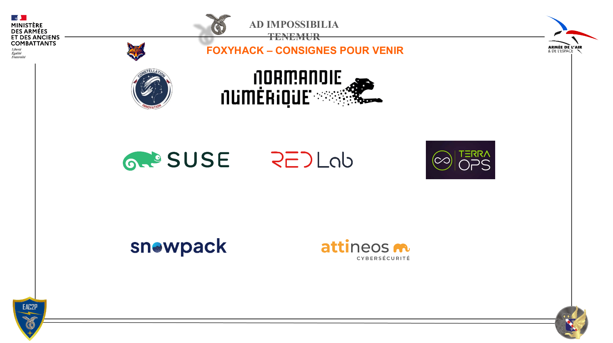

# Trace-OPS - POC Traceabilite Decisionnelle


## Contexte
Participation au Hackathon FoxyHack 2026 : le hackathon au service de la souveraineté nunérique 
</br>
- *15 déc 2025 – 31 jan 2026 : phase de recherche et préparation à distance*
- *08 – 10 fév 2026 : hackathon en présentiel à Évreux*

## Teams 
- [Thox](https://github.com/DIGIX666) : Théo Dubois - Dev Fullstack, Blockchain
- [Simon](https://github.com/SLecureu) : Simon Lecureux - Dev Fullstack 

## Vision
Trace-OPS vise a apporter une trace de confiance sur la chaine de decision operationnelle, entre la remontee d alertes terrain, la preanalyse J2, la decision humaine J3/EM, et le RETEX. Le POC demontre la faisabilite technique sans connexion a des SI classes et uniquement avec des donnees fictives.

## Objectifs du POC
- Prouver la traceabilite des decisions humaines via un registre append-only.
- Illustrer un flux complet : alerte -> preanalyse -> decision -> ancrage -> timeline.
- Verifier la separation des zones reseau et la securisation des flux.
- Produire une demo claire et reproductible en environnement de test.

## Perimetre fonctionnel
1. Remontee d'information : interface d injection d alertes.
2. Preanalyse J2 : moteur de scoring et synthese.
3. Decision EM : validation/rejet/arbitrage avec roles.
4. Registre de traceabilite : ancrage des empreintes de decisions.
5. Timeline/RETEX : reconstruction chronologique des decisions.

Hors perimetre POC
- Interconnexion avec des SI operationnels reels.
- Decision automatisee par IA.
- Chiffrement post-quantique.

## Architecture cible (POC)
Le SI est segmente en trois zones reseau isolees et controlees par pare-feux.

Schema detaille (services, infra, securite)

```
                            Utilisateurs
                                 |
                              HTTPS 443
                                 v
                    +---------------------------+
                    | Ingress / Reverse Proxy   |
                    | (Traefik, TLS)            |
                    +---------------------------+
                                 |
                                 v
    +---------------------------------------------------------+
    | Zone 1 - Reseau utilisateurs/analystes                  |
    |                                                         |
    |  +-------------+    REST/TLS    +-------------------+   |
    |  | UI Alertes  |--------------->| API FastAPI (J2/EM)|  |
    |  +-------------+                | - scoring J2       |  |
    |          ^                      | - decisions EM     |  |
    |          |                      +-------------------+   |
    |      HTTPS 443                           |              |
    |  +-------------+                         | gRPC/TLS 7050|
    |  | UI EM /     |<------------------------+              |
    |  | Decision    |                                        |
    |  +-------------+                                        |
    |                                                         |
    |  +-------------+                                        |
    |  | IAM / SSO   |<---- OIDC/JWT -----> API               |
    |  | (Keycloak)  |                                        |
    |  +-------------+                                        |
    +---------------------------------------------------------+
                                 |
                                 v
    +---------------------------------------------------------+
    | Zone 2 - Reseau ledger/infrastructure                   |
    |  +-----------------+   +-----------------------------+  |
    |  | Fabric CA       |   | Fabric Orderer + Peers       | |
    |  +-----------------+   +-----------------------------+  |
    |            |                     |                      |
    |            +----> World State (CouchDB/LevelDB)         |
    +---------------------------------------------------------+
                                 |
                                 v
    +---------------------------------------------------------+
    | Zone 3 - Reseau RETEX                                   |
    |  +-----------------+   gRPC/TLS 7051                    |
    |  | Timeline Service |<---------------------------------+|
    |  +-----------------+                                    |
    |          | HTTPS 443                                    |
    |          v                                              |
    |  +-----------------+                                    |
    |  | UI Timeline      |                                   |
    |  +-----------------+                                    |
    +---------------------------------------------------------+

Notes securite
- TLS partout, mTLS pour l acces ledger.
- Aucun flux sortant Internet.
- Segmentation par pare-feux entre zones.
```

### Zones
- Zone 1 - Reseau utilisateurs/analystes : application d alertes, moteur J2, interface EM.
- Zone 2 - Reseau ledger/infrastructure : Hyperledger Fabric + base etat.
- Zone 3 - Reseau RETEX : service Timeline (lecture du registre).

### Services
- Service de remontee d alertes : UI web pour injecter les alertes.
- Service de preanalyse J2 : scoring + synthese via API REST.
- Service de decision EM : UI de validation/rejet/arbitrage.
- Service ledger : enregistrement des empreintes et horodatage.
- Service Timeline/RETEX : chronologie et consultation.

### Flux principaux
- UI alertes -> moteur J2 : HTTP/REST (interne, TLS si inter-conteneur).
- Interface EM -> Ledger : gRPC/TLS (7050) pour ancrage.
- Ledger -> Timeline : gRPC/TLS (7051) pour lecture.
- Timeline -> UI EM : HTTPS (443) pour consultation.

## Choix techniques retenus
- Portail utilisateur et interface decisionnelle : Vue.js (MIT).
- API decisionnelle et orchestration : FastAPI (Python).
- Registre de traceabilite : Hyperledger Fabric v2.5 (Apache 2.0).
- Base de metadonnees : PostgreSQL.
- IAM/SSO : Keycloak (OIDC, RBAC).
- Reverse proxy TLS : Traefik.
- Observabilite : Prometheus + Grafana + Loki.

## Hypotheses et contraintes POC
- Donnees fictives uniquement.
- Aucun flux sortant Internet.
- TLS partout, mTLS pour le ledger.
- Environnement de demo deconnecte des reseaux reels.
- Dimensionnement POC sur VM Ubuntu Server 22.04.

## Livrables attendus
- POC fonctionnel end-to-end.
- README + roadmap datee.
- Script de demo et jeu d'alertes fictif.
- Diagrammes/flux et parametres reseau de reference.

## Roadmap

### Phase 1 - Fondamentaux (jusqu au 7 fevrier)
Objectif : cadrer, securiser et figer les bases techniques et fonctionnelles.

Travaux
- Cadrage fonctionnel final + parcours utilisateur (alertes, J2, EM, RETEX).
- Modele de donnees : alerte, analyse, decision, empreinte.
- Contrats API (OpenAPI) et schema de roles (J2/J3/EM/SA).
- Schema ledger minimal (transaction de decision + hash SHA-256).
- Architecture reseau finalisee (ports, zones, flux).
- Plan d infra POC (VM, conteneurs, volumes, TLS, mTLS).
- Jeux de donnees fictifs + scenario de demo.

Repartition (equipe de 2)
- Personne A : parcours utilisateurs, UI POC, dataset demo.
- Personne B : API/ledger, schema de donnees, infra et securite.

Point de synchronisation
- Fin de phase : demo sur maquette (UI + API mock + schema ledger valide).

### Phase 2 - Build POC (9-10 fevrier)
Objectif : assembler le flux complet et livrer une demo fiable.

Travaux
- UI alertes + UI EM + timeline (version demo).
- API FastAPI : ingestion, scoring basique, decision.
- Integration ledger : enregistrement d empreinte et lecture.
- Timeline : extraction et visualisation.
- Mise en place du reverse proxy et TLS.
- Observabilite minimale (logs + metriques).
- Run de demo avec chronologie complete.

Critere de succes
- Un observateur peut suivre une alerte, voir l analyse, la decision, puis la trace dans la timeline.
- L empreinte est verifiable et liee a la decision humaine.
- Les flux respectent les zones reseau et TLS.

## Limites du POC
- Pas de charge reellement representative.
- Pas d'interconnexion avec SI operationnels.
- IA limitee a l'aide a la synthese, pas de decision automatique.

## Next steps possibles
1) Ajouter des regles metier J2 plus riches et parametrables.
2) Durcir la securite (HSM, politiques mTLS avancees).
3) Preparer une integration avec un SI tiers en environnement isole.
